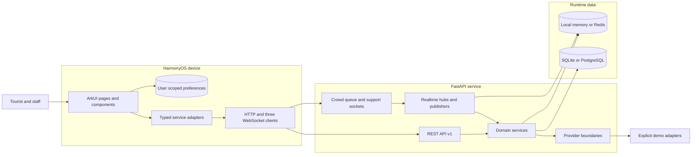

# System architecture

This document describes the architecture implemented in the repository. It distinguishes durable application behavior from explicit demo integrations; the detailed integration inventory is in [Mock and integration boundaries](mock-boundaries.md), and the relational model is in [Data model](data-model.md).

## System view

The editable source is [architecture.mmd](architecture.mmd). The diagram intentionally shows logical roles, not independent deployables: domain services, realtime publishers, and provider adapters currently run inside the FastAPI process.

## Runtime modes

| Mode | Durable store | Coordination | Intended topology and behavior |
|---|---|---|---|
| Local fallback | SQLite through `aiosqlite` | Bounded in-process maps, queues, locks, rate counters, one-use WebSocket tickets, and no-op cross-process publish/subscribe | Default development configuration. SQLite enables foreign keys, a 5 s busy timeout, and WAL for file databases. Correct for a single API process; neither coordination state nor fan-out is shared between workers. See [settings](../server/app/core/config.py#L24), [SQLite engine setup](../server/app/db/session.py#L21), and [local coordination](../server/app/core/coordination.py#L140). |
| Full mode | PostgreSQL through `asyncpg`, with configured connection pooling | Redis for optional cache, rate limits, advisory locks/leader claims, one-use WebSocket tickets, and cross-worker pub/sub | The Compose deployment enables every Redis feature and defaults `REDIS_REQUIRED=true`, so startup fails rather than silently becoming a multi-worker local topology. PostgreSQL and SQL constraints remain authoritative; Redis reduces duplicate work and coordinates workers. See [Compose wiring](../docker-compose.yml#L3), [runtime selection](../server/app/main.py#L39), and [Redis backend](../server/app/core/coordination.py#L402). |

Redis is explicitly opt-in outside Compose. With `REDIS_REQUIRED=false`, startup or feature failures degrade to the local backend and are logged; that preserves a worker's availability but not distributed coordination guarantees. Feature flags select Redis independently for caching, rate limiting, locks, WebSocket tickets, and pub/sub ([configuration](../server/app/core/config.py#L62)).

## Server layers and request flow

1. **Application edge.** The FastAPI factory owns lifespan, middleware, routers, coordination backends, three hubs, and the crowd/queue publisher tasks ([application factory](../server/app/main.py#L69)). HTTP middleware establishes request IDs and access logs, trusted-host/CORS policy, browser security headers, and actor/IP rate limits ([middleware](../server/app/core/middleware.py#L117)).
2. **Transport.** `/health` is unversioned; product routes are composed under `/api/v1` ([router composition](../server/app/api/router.py#L18)). Pydantic request/response schemas keep transport contracts separate from SQLAlchemy models.
3. **Authorization.** Route dependencies load a bearer access token and enforce tourist, merchant, support, or admin roles; `admin` is the deliberate superuser bypass ([authorization dependencies](../server/app/api/dependencies/auth.py#L20)).
4. **Domain services.** Route modules are thin coordinators over authentication, ticketing, guide/itinerary, reservation, queue, commerce/points, feedback/support/groups, offline, safety, and passport services. Services own state transitions, ownership checks, request hashing, conditional SQL updates, and transaction commits.
5. **Provider boundaries.** Payment, schematic routing, rules planning, sharing, support bot, emergency dispatch, check-in, and green verification are injected at service-call boundaries. Current defaults are deterministic demo implementations; replacing them does not require changing REST response shapes.
6. **Persistence.** A request-scoped async SQLAlchemy session reads and mutates the relational source of truth ([session lifecycle](../server/app/db/session.py#L72)). Alembic revisions `0001` through `0007` define the deployed schema.

A normal mutation therefore flows `ArkUI page -> typed client service -> HttpClient -> FastAPI route -> domain service -> provider if required -> conditional SQL writes -> committed response`. Provider success is never the sole correctness boundary: the service transition and its inventory/idempotency records must also commit.

## REST and realtime channels

REST is the baseline for catalogs, current state, commands, and reconnect recovery. Realtime adds latest-event delivery through exactly three WebSocket endpoints:

| Channel | Endpoint | Authentication and source | Recovery/ordering behavior |
|---|---|---|---|
| Crowd | `/api/v1/guide/ws/crowd` | Public, matching the public guide data. A lifespan publisher persists synthetic snapshots, then broadcasts them through the crowd hub ([route](../server/app/api/routes/guide.py#L107), [publisher](../server/app/realtime/crowd.py#L100)). | Sends an initial database-backed snapshot. Each connection has a one-item latest-value queue; the client rejects non-increasing sequences and can refresh from `GET /guide/crowd`. |
| Queue | `/api/v1/ws/queues/{queue_id}` | The authenticated REST endpoint `/ws-tickets` issues a short-lived, queue- and user-bound, atomically consumed ticket. The queue must still be active when the socket opens ([route and ticket exchange](../server/app/api/routes/marketplace.py#L318), [ticket store](../server/app/realtime/queues.py#L40)). | Sends current persisted state first. A lifespan simulation advances queues; per-queue latest-value fan-out carries sequence numbers. REST `GET /queues/{id}` is the reconnect source of truth. |
| Support | `/api/v1/ws/support/{conversation_id}` | A support-scoped one-use ticket is bound to the authorized user and conversation ([route](../server/app/api/routes/support.py#L150), [ticket store](../server/app/realtime/support.py#L34)). Messages are persisted before broadcast. | Initial state includes persisted conversation/messages. Per-conversation queues retain up to ten events; `(conversation_id, sequence)` and sender idempotency keys enforce order and replay safety. REST list/message endpoints restore state. |

In local mode hubs fan out only inside one process. In full mode, Redis pub/sub joins hubs across workers and leader claims prevent every worker from publishing the same crowd/queue simulation tick. WebSocket delivery is an acceleration path, not durable storage.

## Correctness and security boundaries

### Identity and transport security

- Passwords use Argon2id. Access, refresh, and ticket-QR JWTs require the configured algorithm, issuer, audience, type, timestamps, subject, and JTI ([security primitives](../server/app/core/security.py#L15)).
- Refresh tokens rotate through persisted families. Reuse or invalid rotation revokes the family ([auth service](../server/app/services/auth.py#L114)). Access tokens remain short-lived and role checks query the active user.
- Production configuration rejects debug/demo accounts, wildcard or non-HTTPS CORS origins, wildcard trusted hosts, disabled security headers, and short/placeholder JWT secrets ([production validation](../server/app/core/config.py#L153)). Forwarded client IPs affect rate limits only when the direct peer belongs to an explicit trusted-proxy network.
- Ticket QR responses are `no-store`; the signed short-lived bearer includes ticket ID, slot ID, ticket version, and `purpose=gate_validation`. Gate validation is admin-authorized and idempotent ([QR creation](../server/app/core/security.py#L110), [gate route](../server/app/api/routes/ticketing.py#L231)). The physical-gate boundary remains a demo integration.

### Idempotency and optimistic transitions

Mutation resources generally persist `(user_id, idempotency_key, request_hash)`. A replay with the same canonical payload returns the existing result; reuse with different content is a `409 IDEMPOTENCY_CONFLICT`. Database uniqueness closes the race after preflight checks, and services reload the winning row after `IntegrityError`. State transitions also predicate on the current `status` and/or `version`, so stale writers cannot silently overwrite a completed transition.

Redis idempotency locks are advisory contention reduction only. Durable unique constraints, request hashes, version predicates, and the SQL transaction remain the correctness boundary. This lets SQLite fallback and PostgreSQL full mode expose the same semantics.

### Inventory and schedule safety

- Ticket availability is claimed with one conditional update requiring `capacity - reserved - sold >= quantity`; payment atomically changes the order version/status and moves units from `reserved` to `sold` ([ticket order](../server/app/services/ticketing.py#L355), [payment transition](../server/app/services/ticketing.py#L518)).
- Experience, hospitality, and bundle reservations allocate all required `inventory_buckets` in one transaction. The database invariant is `held + confirmed <= capacity`; confirm, cancel, and expiry transfer or release every allocation together ([reservation creation](../server/app/services/reservations.py#L557)).
- Shop checkout conditionally decrements every product stock row and creates immutable order-line snapshots in one transaction; failure rolls back all decrements ([shop checkout](../server/app/services/commerce.py#L480)). Points and reward stock use versioned row claims and a unique source ledger entry.
- A per-user `user_schedule_locks` row serializes the conflict check across tickets and reservations, avoiding two individually valid bookings that overlap when committed concurrently ([schedule lock](../server/app/services/reservations.py#L173)). Redis inventory locks reduce contention across workers but do not replace these SQL guards.

### Offline data and sync

The client keeps user-scoped cached ticket identity, itinerary, shop orders, offline packs, and an outbox in HarmonyOS Preferences ([persistence store](../client/entry/src/main/ets/stores/TravelPersistenceStore.ets#L14)). Cached envelopes carry an owner and schema version; changing users does not expose another user's records. Short-lived QR bearer data is intentionally excluded from the offline pack and from durable device storage ([offline UI contract](../client/entry/src/main/ets/components/profile/OfflineEmergencyView.ets#L629)).

Offline packs expose ETag, manifest hash, per-asset hash, size, and required flags. Sync cursors are opaque HMAC-signed values bound to user and device. Push accepts only validated `NOTE`, `ITINERARY_ACK`, and `EMERGENCY_ACK` mutations; versions must increase per device, a user-wide counter allocates a strict server cursor, and duplicate client mutation IDs replay only when the request hash matches. Pull is ordered by that cursor ([offline service](../server/app/services/offline.py#L59), [push transaction](../server/app/services/offline.py#L463)). SOS has a separately labelled local retry draft because it is not part of the general mutation whitelist and never implies real dispatch.

## Client layering and adaptive layout

The HarmonyOS client is organized as:

- `pages/` and feature `components/` for orchestration and declarative ArkUI rendering;
- typed `network/services/` adapters for REST use cases, plus dedicated crowd, queue, and support socket clients;
- `models/` for wire and persisted shapes, and pure `utils/` rules for validation, formatting, conflict handling, accessibility, and sequence acceptance;
- singleton stores for access-token/session state, network quality, cross-page state, accessibility preferences, and user-scoped device persistence;
- `HttpClient` for bearer injection, network detection, bounded retry of safe requests, ETag handling, API-error mapping, and online/weak/offline state ([HTTP client](../client/entry/src/main/ets/network/HttpClient.ets#L57)).

`Index` is the composition root. It observes window-area changes and treats widths of at least `720 vp` as wide ([responsive rule](../client/entry/src/main/ets/utils/ResponsiveRules.ets#L1), [root page](../client/entry/src/main/ets/pages/Index.ets#L17)). Compact windows use bottom navigation; wide windows use persistent side navigation, while feature views receive the width mode and switch from stacked sections to columns where useful. Accessibility settings change content extent, navigation sizes, and text sizes without creating a separate application path.

## Deployment implications

- Run Alembic migrations and seed reference/demo data explicitly; application startup does not create tables.
- Use one API process for SQLite/local coordination. For multiple workers or replicas, use PostgreSQL and enable Redis coordination with `REDIS_REQUIRED=true`.
- Treat SQL as the recovery source after socket reconnects or Redis loss. Redis persistence configuration improves operational recovery but does not make Redis domain storage.
- Provider flags such as `provider`, `mode`, `source`, and `is_demo` are part of the user-visible truthfulness contract and must remain accurate when an adapter is replaced.
